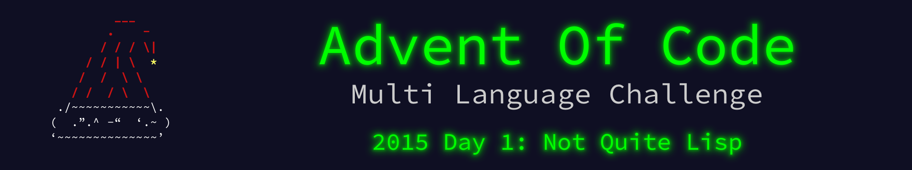

 

    

The write up for this Advent of Code challenge is available on [YearOf.Dev](https://yearof.dev) at [htts://yearof.dev/2026/01/01/aoc-2015-01](htts://yearof.dev/2026/01/01/aoc-2015-01).

## Timings

| Language | Part 1 | Part 2 | Total |
| ----- | ----- | ----- | ----- |
| Typescript | 263850 | 74108 | 493091 |
| Go | 77958 | 26975 | 2728991 |
| Python | 187200 | 79800 | 423400 |
| Rust | 92283 | 30108 | 204891 |

## Win/Loss

| Language | Part 1 | Part 2 | Total |
| ----- | ----- | ----- | ----- |
| Typescript | ❌ | ➖ | ➖ |
| Go | ⭐ | ⭐ | ❌ |
| Python | ➖ | ❌ | ➖ |
| Rust | ➖ | ➖ | ⭐ |