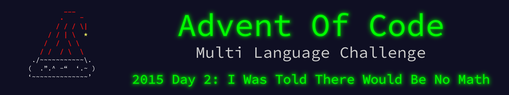

 

    

The write up for this Advent of Code challenge is available on [YearOf.Dev](https://yearof.dev) at [htts://yearof.dev/2026/01/02/aoc-2015-02](htts://yearof.dev/2026/01/02/aoc-2015-02).

## Timings

| Language | Part 1 | Part 2 | Total |
| ----- | ----- | ----- | ----- |
| Typescript | 494883 | 751791 | 1442933 |
| Go | 251616 | 98975 | 3206833 |
| Python | 508600 | 421400 | 1107400 |
| Rust | 267658 | 248358 | 782699 |

## Win/Loss

| Language | Part 1 | Part 2 | Total |
| ----- | ----- | ----- | ----- |
| Typescript | ➖ | ❌ | ➖ |
| Go | ⭐ | ⭐ | ❌ |
| Python | ❌ | ➖ | ➖ |
| Rust | ➖ | ➖ | ⭐ |