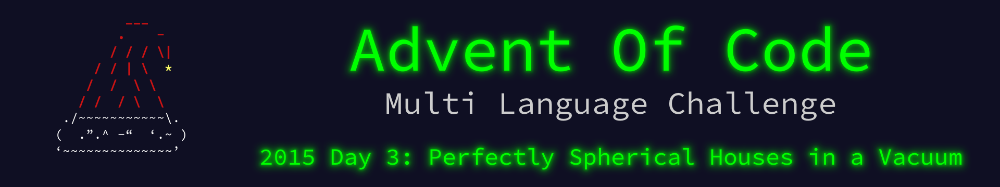

 

    

The write up for this Advent of Code challenge is available on [YearOf.Dev](https://yearof.dev) at [htts://yearof.dev/2026/01/03/aoc-2015-3](htts://yearof.dev/2026/01/03/aoc-2015-3).

## Timings

| Language | Part 1 | Part 2 | Total |
| ----- | ----- | ----- | ----- |
| Typescript | 27211275 | 34350275 | 61757983 |
| Go | 3518525 | 3835541 | 10011600 |
| Python | 490533000 | 468463000 | 959153000 |
| Rust | 2834816 | 2892375 | 5822000 |

## Win/Loss

| Language | Part 1 | Part 2 | Total |
| ----- | ----- | ----- | ----- |
| Typescript | ➖ | ➖ | ➖ |
| Go | ➖ | ➖ | ➖ |
| Python | ❌ | ❌ | ❌ |
| Rust | ⭐ | ⭐ | ⭐ |
