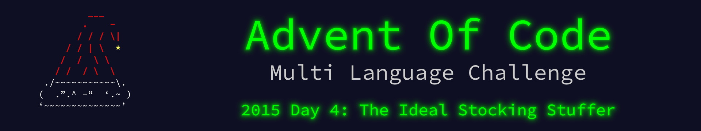

 

    

The write up for this Advent of Code challenge is available on [YearOf.Dev](https://yearof.dev) at [htts://yearof.dev/2026/01/04/aoc-2015-4](htts://yearof.dev/2026/01/04/aoc-2015-4).

## Timings

| Language | Part 1 | Part 2 | Total |
| ----- | ----- | ----- | ----- |
| Typescript | 812800867 | 22260993768 | 23074003394 |
| Go | 156569333 | 3964395527 | 4123724401 |
| Python | 142827800 | 6423447800 | 6566456200 |
| Rust | 942480817 | 27124219495 | 28066783304 |

## Win/Loss

| Language | Part 1 | Part 2 | Total |
| ----- | ----- | ----- | ----- |
| Typescript | ➖ | ➖ | ➖ |
| Go | ➖ | ⭐ | ⭐ |
| Python | ⭐ | ➖ | ➖ |
| Rust | ❌ | ❌ | ❌ |
