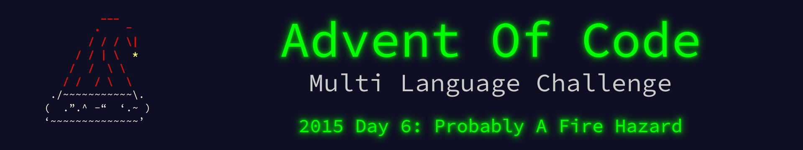

 

    

The write up for this Advent of Code challenge is available on [YearOf.Dev](https://yearof.dev) at [htts://yearof.dev/2026/01/06/aoc-2015-6](htts://yearof.dev/2026/01/06/aoc-2015-6).

## Timings

| Language | Part 1 | Part 2 | Total |
| ----- | ----- | ----- | ----- |
| Typescript | 128828866 | 116145000 | 245673891 |
| Go | 717746767 | 707686392 | 1428171900 |
| Python | 1050528800 | 1365041800 | 2416239000 |
| Rust | 8289358370 | 12248982897 | 20538532576 |

## Win/Loss

| Language | Part 1 | Part 2 | Total |
| ----- | ----- | ----- | ----- |
| Typescript | ⭐ | ⭐ | ⭐ |
| Go | ➖ | ➖ | ➖ |
| Python | ➖ | ➖ | ➖ |
| Rust | ❌ | ❌ | ❌ |
