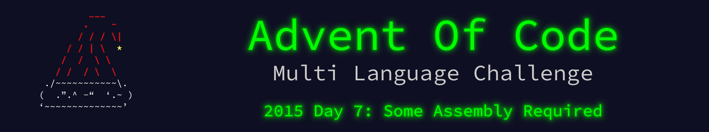

 

    

The write up for this Advent of Code challenge is available on [YearOf.Dev](https://yearof.dev) at [htts://yearof.dev/2026/01/07/aoc-2015-7](htts://yearof.dev/2026/01/07/aoc-2015-07).

## Timings

| Language | Part 1 | Part 2 | Total |
| ----- | ----- | ----- | ----- |
| Typescript | 5776983 | 9684041 | 15681366 |
| Go | 4316308 | 7299450 | 14138883 |
| Python | 6679000 | 11379000 | 18213600 |
| Rust | 22261300 | 44381908 | 66797891 |

## Win/Loss

| Language | Part 1 | Part 2 | Total |
| ----- | ----- | ----- | ----- |
| Typescript | ➖ | ➖ | ➖ |
| Go | ⭐ | ⭐ | ⭐ |
| Python | ➖ | ➖ | ➖ |
| Rust | ❌ | ❌ | ❌ |
