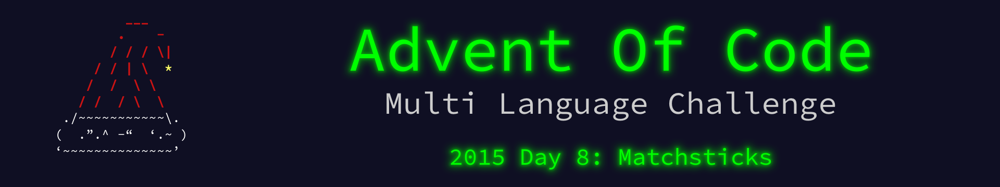

 

    

The write up for this Advent of Code challenge is available on [YearOf.Dev](https://yearof.dev) at [htts://yearof.dev/2026/01/08/aoc-2015-08](htts://yearof.dev/2026/01/08/aoc-2015-08).

## Timings

| Language | Part 1 | Part 2 | Total |
| ----- | ----- | ----- | ----- |
| Typescript | 231350 | 164333 | 589624 |
| Go | 4167833 | 574850 | 7450566 |
| Python | 456000 | 264200 | 883600 |
| Rust | 29212749 | 3409641 | 32795341 |

## Win/Loss

| Language | Part 1 | Part 2 | Total |
| ----- | ----- | ----- | ----- |
| Typescript | ⭐ | ⭐ | ⭐ |
| Go | ➖ | ➖ | ➖ |
| Python | ➖ | ➖ | ➖ |
| Rust | ❌ | ❌ | ❌ |
