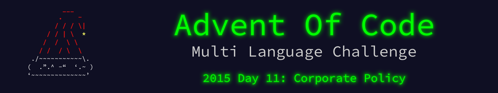

 

    

The write up for this Advent of Code challenge is available on [YearOf.Dev](https://yearof.dev) at [htts://yearof.dev/2026/01/11/aoc-2015-11](htts://yearof.dev/2026/01/11/aoc-2015-11).

## Timings

| Language | Part 1 | Part 2 | Total |
| ----- | ----- | ----- | ----- |
| Typescript | 19598416 | 64390166 | 84232916 |
| Go | 27383033 | 142016708 | 172372683 |
| Python | 120380400 | 570487800 | 691063200 |
| Rust | 283686299 | 1329396808 | 1613170067 |

## Win/Loss

| Language | Part 1 | Part 2 | Total |
| ----- | ----- | ----- | ----- |
| Typescript | ⭐ | ⭐ | ⭐ |
| Go | ➖ | ➖ | ➖ |
| Python | ➖ | ➖ | ➖ |
| Rust | ❌ | ❌ | ❌ |
