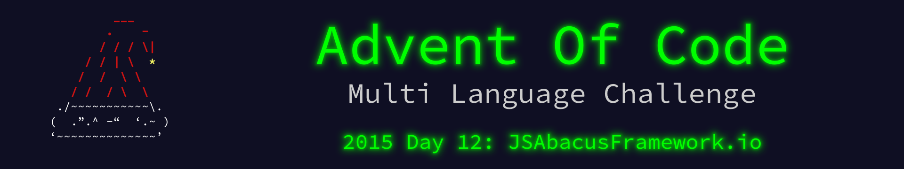

 

    

The write up for this Advent of Code challenge is available on [YearOf.Dev](https://yearof.dev) at [htts://yearof.dev/2026/01/12/aoc-2015-12](htts://yearof.dev/2026/01/12/aoc-2015-12).

## Timings

| Language | Part 1 | Part 2 | Total |
| ----- | ----- | ----- | ----- |
| Typescript | 700700 | 450575 | 1402591 |
| Go | 2546708 | 551066 | 5871441 |
| Python | 941800 | 515800 | 1664400 |
| Rust | 4797308 | 4312833 | 9248458 |

## Win/Loss

| Language | Part 1 | Part 2 | Total |
| ----- | ----- | ----- | ----- |
| Typescript | ⭐ | ⭐ | ⭐ |
| Go | ➖ | ➖ | ➖ |
| Python | ➖ | ➖ | ➖ |
| Rust | ❌ | ❌ | ❌ |
