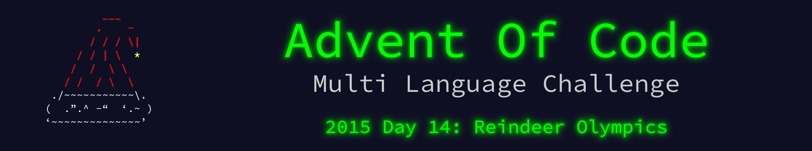

 

    

The write up for this Advent of Code challenge is available on [YearOf.Dev](https://yearof.dev) at [htts://yearof.dev/2026/01/14/aoc-2015-14](htts://yearof.dev/2026/01/14/aoc-2015-14).

## Timings

| Language | Part 1 | Part 2 | Total |
| ----- | ----- | ----- | ----- |
| Typescript | 81183 | 4452616 | 4718733 |
| Go | 440233 | 802316 | 3871125 |
| Python | 23600 | 4452000 | 4622400 |
| Rust | 28141 | 5899275 | 6036799 |

## Win/Loss

| Language | Part 1 | Part 2 | Total |
| ----- | ----- | ----- | ----- |
| Typescript | ➖ | ➖ | ➖ |
| Go | ❌ | ⭐ | ⭐ |
| Python | ⭐ | ➖ | ➖ |
| Rust | ➖ | ❌ | ❌ |
