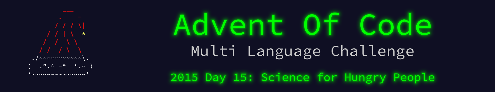

 

    

The write up for this Advent of Code challenge is available on [YearOf.Dev](https://yearof.dev) at [htts://yearof.dev/2026/01/15/aoc-2015-15](htts://yearof.dev/2026/01/15/aoc-2015-15).

## Timings

| Language | Part 1 | Part 2 | Total |
| ----- | ----- | ----- | ----- |
| Typescript | 50879775 | 44906575 | 95993550 |
| Go | 123978108 | 104961200 | 231725175 |
| Python | 128512600 | 120733400 | 249430000 |
| Rust | 890769433 | 960951333 | 1852990892 |

## Win/Loss

| Language | Part 1 | Part 2 | Total |
| ----- | ----- | ----- | ----- |
| Typescript | ⭐ | ⭐ | ⭐ |
| Go | ➖ | ➖ | ➖ |
| Python | ➖ | ➖ | ➖ |
| Rust | ❌ | ❌ | ❌ |
