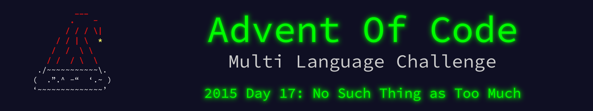

 

    

The write up for this Advent of Code challenge is available on [YearOf.Dev](https://yearof.dev) at [htts://yearof.dev/2026/01/17/aoc-2015-17](htts://yearof.dev/2026/01/17/aoc-2015-17).

## Timings

| Language | Part 1 | Part 2 | Total |
| ----- | ----- | ----- | ----- |
| Typescript | 92450 | 732050 | 1000241 |
| Go | 60108 | 90125 | 2738649 |
| Python | 94600 | 749400 | 1035600 |
| Rust | 57774 | 435533 | 599658 |

## Win/Loss

| Language | Part 1 | Part 2 | Total |
| ----- | ----- | ----- | ----- |
| Typescript | ➖ | ➖ | ➖ |
| Go | ➖ | ⭐ | ❌ |
| Python | ❌ | ❌ | ➖ |
| Rust | ⭐ | ➖ | ⭐ |
